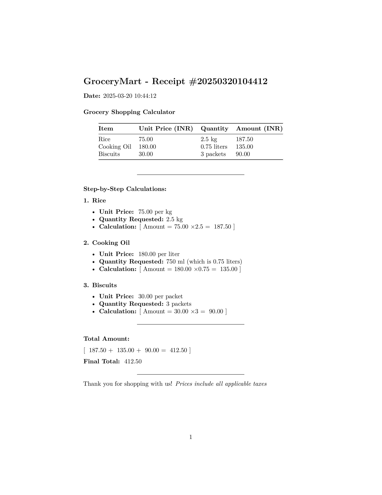
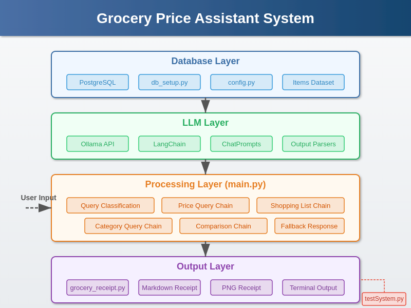
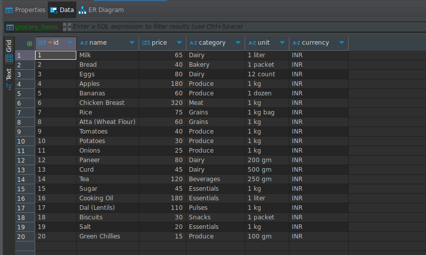

# Grocery Price Assistant

An intelligent grocery shopping assistant that calculates prices, generates beautiful receipts and answers questions about your grocery database using LLM and Langchain.



## Overview

Grocery Price Assistant is a powerful tool that combines a PostgreSQL database of grocery items with LangChain and a local Large Language Model (DeepSeek-R1) to provide accurate price calculations and professional receipts. The system handles various query types including price lookups, shopping lists, category queries, and price comparisons.

## Key Features

- **Natural Language Processing**: Ask questions in plain English about prices and grocery items
- **Detailed Price Calculations**: Get step-by-step breakdowns of your shopping list costs
- **Beautiful Receipt Generation**: Generate professional PDF and PNG receipts with a single command
- **Multiple Query Types**: Supports price lookups, shopping lists, category queries, and price comparisons
- **Private and Secure**: All processing happens locally - no data sent to external services

## System Architecture

The Grocery Price Assistant is built with a layered architecture that provides flexibility and separation of concerns:



## Installation and Setup

### Prerequisites

- Python 3.8+
- PostgreSQL
- Ollama (for running the local LLM)

### Getting Started

1. **Clone the repository**

```bash

cd grocery_price_assistant
```

2. **Set up a virtual environment**

```bash
# Create virtual environment
python -m venv .venv

# Activate virtual environment (Linux/macOS)
source .venv/bin/activate

# Activate virtual environment (Windows)
# .venv\Scripts\activate
```

3. **Install dependencies**

```bash
pip install -r requirements.txt
```

Key dependencies include:
- langchain
- langchain-ollama
- psycopg2-binary
- pdf2image
- pillow
- pandoc (system package for receipt generation)

4. **Install system dependencies for receipt generation**

```bash
# For Ubuntu/Debian
sudo apt-get install pandoc texlive-xetex fonts-dejavu

# For macOS (using Homebrew)
# brew install pandoc
# brew cask install basictex
```

5. **Download the DeepSeek-R1 model**

The system uses DeepSeek-R1, a powerful reasoning model with excellent performance for mathematical operations and logical reasoning:

```bash
# Make sure Ollama is running, then pull the model
ollama pull deepseek-r1:32b
```

> **About DeepSeek-R1**: This model is a 32B parameter reasoning model that excels at mathematical calculations and logical deduction. It provides accurate results while maintaining privacy since all processing happens locally. DeepSeek-R1 achieved impressive scores on benchmarks such as MATH-500 (97.3%), AIME 2024 (79.8%), and LiveCodeBench (65.9%), making it ideal for precise price calculations and conversions.

### Environment Configuration

Create a `.env` file in the project root:

```
# Database Configuration
DB_NAME=your_db_name
DB_USER=your_db_user
DB_PASSWORD=your_password
DB_HOST=localhost
DB_PORT=5432

# LLM Configuration
OLLAMA_BASE_URL=http://localhost:11434
MODEL_NAME=deepseek-r1:32b
```

### Database Setup

1. Ensure PostgreSQL is running
2. Run the database setup script:

```bash
python db_setup.py
```

This will create a table with 20 sample grocery items:



## Usage

### Basic Price Assistant

Start the interactive assistant:

```bash
python main.py
```

Example interaction:

```
Welcome to the Grocery Price Assistant!
All prices are listed in INR (₹)
Ask me about the prices of grocery items, or type 'exit' to quit.
Example: 'I want to buy 2L milk, 1kg tomatoes, and 3 packets of bread'

Your question: How much do tomatoes cost?
Assistant: Tomatoes cost ₹40 per kg.

Your question: Calculate 2kg rice and 3 packets of bread

A: 
| Item      | Unit Price | Quantity | Amount |
|-----------|------------|----------|--------|
| Rice      | ₹75/kg     | 2 kg     | ₹150   |
| Bread     | ₹40/packet | 3 packets| ₹120   |

Total: ₹270
```

### Generate Receipts

For beautiful receipts in PNG format:

```bash
python grocery_receipt.py "2.5kg rice, 750ml cooking oil, and 3 packets of biscuits"
```

This will:
1. Calculate the prices
2. Generate a markdown receipt
3. Convert it to a professional-looking PNG image
4. Open the receipt image automatically

Example receipt output:


### Query Types

The assistant can handle various query types:

1. **Price Queries**:
   - "What is the price of milk?"
   - "How much do tomatoes cost?"

2. **Shopping List Calculations**:
   - "I want to buy 500g rice and 2L milk"
   - "Calculate 2kg rice, 3 packets of bread, and 500ml cooking oil"

3. **Category Queries**:
   - "What items can I buy in the dairy category?"
   - "Show me all produce items"

4. **Price Comparisons**:
   - "Which is more expensive, apples or tomatoes?"
   - "Compare the prices of rice and atta per kg"

5. **Budget Calculations**:
   - "If I have ₹500, how many kg of potatoes can I buy?"
   - "With ₹300, how many packets of bread and liters of milk can I buy?"

## Testing

### Running the Test Suite

```bash
python testSystem.py
```

This runs 16 test cases covering all the query types and edge cases. Results are saved to a file named `grocery_test_results_[timestamp].txt`.

### Understanding the LLM Reasoning

The system uses the DeepSeek-R1 model, which provides detailed reasoning in `<think>...</think>` blocks. For example:

```
<think>
Okay, so I need to figure out how much 500g of rice costs based on the given grocery list. Let me start by looking through the items provided.

First, I'll scan the list for "Rice." There it is, item number 7. The price is listed as 75.0 INR per unit, and the unit is specified as "1 kg bag." So, that means one kilogram of rice costs 75 INR.

Now, the user wants to buy 500 grams. I know that 1 kilogram equals 1000 grams, so 500 grams is half a kilogram. To find out how much half a kilogram costs, I need to calculate half of the price per kilogram.

So, taking the price of 75 INR and dividing it by 2 gives me 37.5 INR for 500 grams.
</think>
```

This step-by-step reasoning helps ensure accurate calculations and provides transparency in how the system arrives at its answers.

## Implementation Details

### LLM Model

The system uses the **DeepSeek-r1:32b** model running locally via Ollama. This model offers excellent reasoning capabilities and accuracy for price calculations, while maintaining privacy since all processing happens locally.

DeepSeek-R1 is particularly well-suited for this application because:
- It excels at mathematical operations and unit conversions
- It provides detailed reasoning steps for complex calculations
- It maintains consistency in output formatting
- It can handle various natural language queries effectively

### Code Structure

- **main.py**: Core application with LangChain chains
- **db_setup.py**: Database initialization
- **config.py**: Configuration settings
- **grocery_receipt.py**: Receipt generation
- **testSystem.py**: Automated testing

### LangChain Components

The system uses several specialized LangChain chains:

1. **Query Classifier**: Determines query type
2. **Price Query Chain**: For simple price lookups
3. **Shopping List Chain**: For multiple items with quantities
4. **Category Query Chain**: For listing items by category
5. **Comparison Chain**: For comparing prices
6. **Fallback Chain**: For unclassified queries

## Examples

### Example 1: Basic Price Query
```
Query: "What is the price of milk?"
Response: "Milk costs ₹65 per liter."
```

### Example 2: Shopping List Calculation
```
Query: "I want to buy 500ml cooking oil and 3.5L milk"
Response:
| Item          | Unit Price | Quantity   | Amount    |
|---------------|------------|------------|-----------|
| Cooking Oil   | ₹180/liter | 500 ml     | ₹90       |
| Milk          | ₹65/liter  | 3.5 liters | ₹227.5    |

Total: ₹317.5
```

### Example 3: Category Query
```
Query: "What items can I buy in the dairy category?"
Response:
- Milk: ₹65 per 1 liter
- Eggs: ₹80 per 12 count
- Paneer: ₹80 per 200 gm
- Curd: ₹45 per 500 gm
```

### Example 4: Price Comparison
```
Query: "Compare the prices of rice and atta per kg"
Response: "Rice costs ₹75 per kg while Atta (Wheat Flour) costs ₹60 per kg.
Atta is cheaper than rice by ₹15 per kg."
```

### Example 5: Budget Calculation
```
Query: "If I have ₹500, how many kg of potatoes can I buy?"
Response: "You can buy 16.67 kg of potatoes with ₹500."
```

## Troubleshooting

### Common Issues

- **Model not found**: Make sure you've pulled the DeepSeek-R1 model using Ollama: `ollama pull deepseek-r1:32b`
- **Receipt generation fails**: Ensure you have pandoc and texlive-xetex installed
- **Database connection errors**: Check your PostgreSQL settings in the `.env` file

## Credits

This project leverages several excellent open-source tools and libraries:

- [Ollama](https://ollama.com/) - Run LLMs locally
- [LangChain](https://python.langchain.com/docs/introduction/) - Framework for developing applications powered by language models
- [DeepSeek](https://www.deepseek.com/) - Provider of the DeepSeek-R1 language model
- [markitdown](https://github.com/microsoft/markitdown.git) - Markdown utilities by Microsoft

## License

This project is licensed under the MIT License - see the LICENSE file for details.